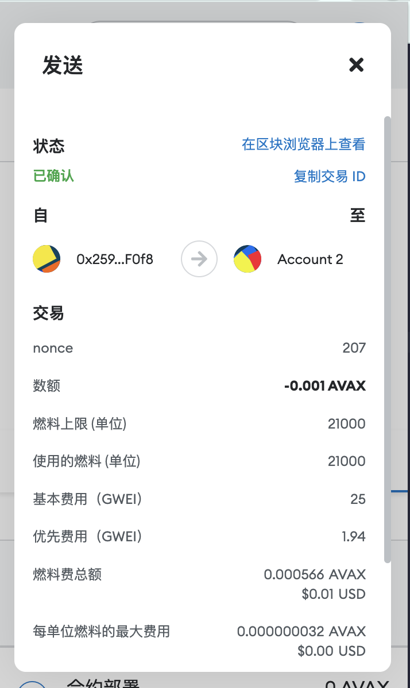
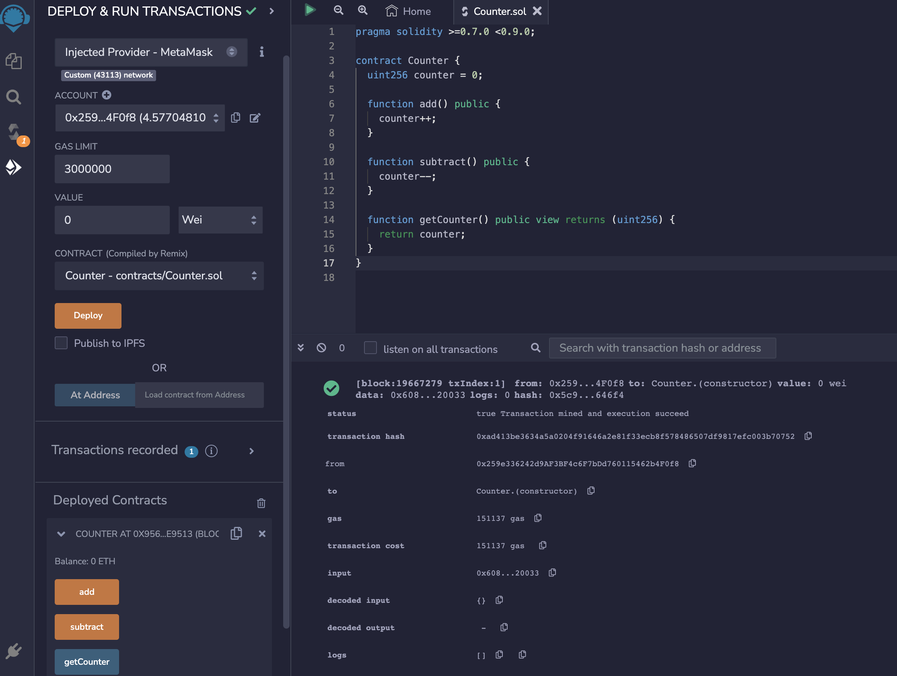

# blockchain_training

## W1-1作业

* 安装Metamask并创建好账号，执行一次转账
<p align="center">
  
</p>

```
https://testnet.snowtrace.io/tx/0x516ab2598221ff8ad5fa8864a3911298866139cfbb3ee6f8821b80d14aec907f
```
---

* 使用Remix创建一个Counter合约（额外完成了合约验证）
<p align="center">
  
</p>

```
https://testnet.snowtrace.io/address/0x1952931cc8f4560eEf8a6B38B4e1a495c8D351E8
```
---