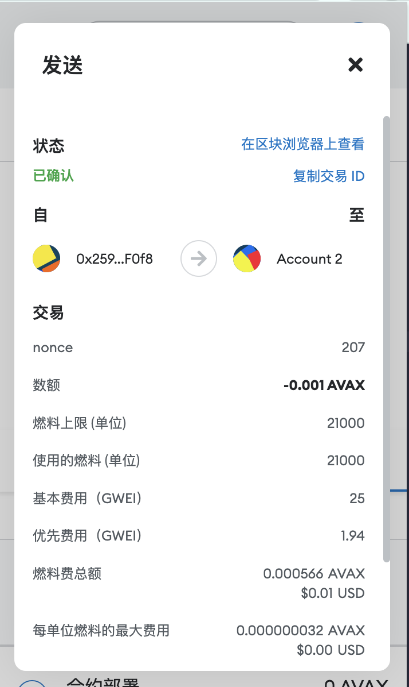

## W1-1作业

### 1.安装Metamask并创建好账号，执行一次转账
<p align="center">
  
</p>

```
https://testnet.snowtrace.io/tx/0x516ab2598221ff8ad5fa8864a3911298866139cfbb3ee6f8821b80d14aec907f
```
---

### 2. 使用Remix创建一个Counter合约（额外完成了合约验证）
* 合约代码
```
// SPDX-License-Identifier: UNLICENSED
pragma solidity >=0.7.0 <0.9.0;

contract Counter {
  uint256 counter = 0;

  function add() public {
    counter++;
  }

  function subtract() public {
    counter--;
  }

  function getCounter() public view returns (uint256) {
    return counter;
  }
}
```
---
* 截图
<p align="center">
  
</p>

```
https://testnet.snowtrace.io/address/0x1952931cc8f4560eEf8a6B38B4e1a495c8D351E8
```
---