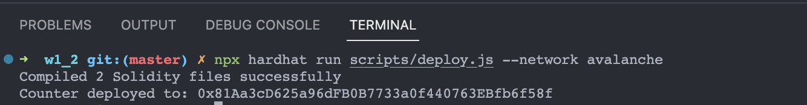
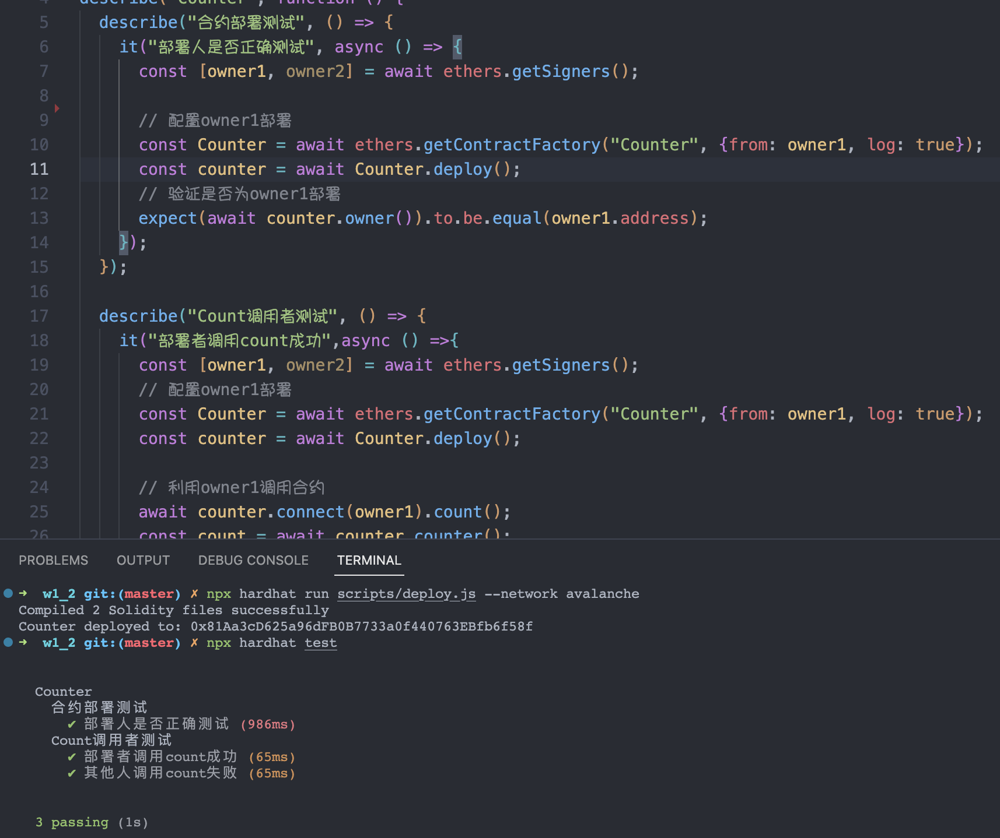

## W1-2作业

### 1. 修改 Counter 合约，仅有部署者 可以调用 count
* 合约代码
```
// SPDX-License-Identifier: UNLICENSED
pragma solidity ^0.8.0;

import "./SafeMath.sol";

contract Counter {
    using SafeMath for uint256;

    uint256 public counter;
    address public owner;

    constructor() {
        owner = msg.sender;
        counter = 0;
    }

    function count() public {
        require(owner == msg.sender, "Only owner is allowed");
        counter = counter.add(1);
    }

    function getCounter() public view returns (uint256) {
        return counter;
    }
}
```

### 2. 使用 Hardhat 部署修改后的 Counter
* 脚本命令
```
npx hardhat run scripts/deploy.js --network avalanche
```
---
* 截图
<p align="center">
  
</p>

### 3. 使用 Hardhat 部署修改后的 Counter
 * Case 1: 部署者成功调用 count 
 * Case 2: 其他地址调用 count 失败
```
const { expect } = require("chai");
const { ethers } = require("hardhat");

describe("Counter", function () {
  describe("合约部署测试", () => {
    it("部署人是否正确测试", async () => {
      const [owner1, owner2] = await ethers.getSigners();

      // 配置owner1部署
      const Counter = await ethers.getContractFactory("Counter", {from: owner1, log: true});
      const counter = await Counter.deploy();
      // 验证是否为owner1部署
      expect(await counter.owner()).to.be.equal(owner1.address);
    });
  });

  describe("Count调用者测试", () => {
    it("部署者调用count成功",async () =>{
      const [owner1, owner2] = await ethers.getSigners();
      // 配置owner1部署
      const Counter = await ethers.getContractFactory("Counter", {from: owner1, log: true});
      const counter = await Counter.deploy();

      // 利用owner1调用合约
      await counter.connect(owner1).count();
      const count = await counter.counter();

      expect(count).to.be.eq(1);
    });

    it("其他人调用count失败", async () => {
      const [owner1, owner2] = await ethers.getSigners();
      // 配置owner1部署
      const Counter = await ethers.getContractFactory("Counter", {from: owner1, log: true});
      const counter = await Counter.deploy();
      // 利用owner2调用合约
      await expect(counter.connect(owner2).count()).to.be.revertedWith("Only owner is allowed");
    });
  });
});
```
* 截图
<p align="center">
  
</p>

### 4. explorer执行相关方法
* 截图
<p align="center">
  
</p>

* 提现成功明细
```
https://testnet.snowtrace.io/tx/0x226ef133ea6d6122c2e9234427ca09bf105f3f476b404324d80de4624f7d7ef6
```