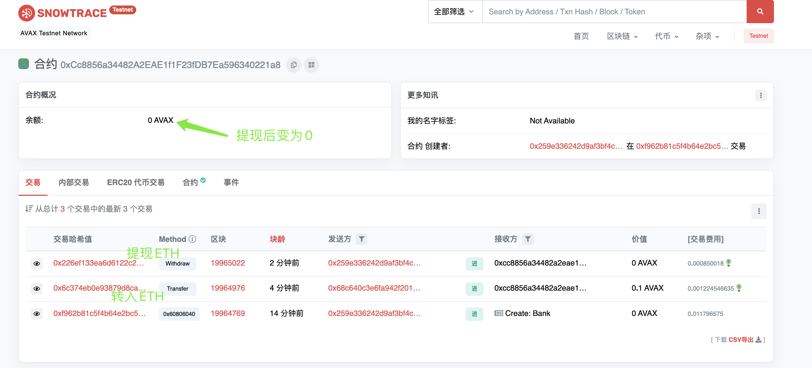

## W2-1作业
### 1. Bank合约代码概览
* 合约代码
```
// SPDX-License-Identifier: UNLICENSED
pragma solidity ^0.8.9;

import "./SafeMath.sol";

contract Bank {
    using SafeMath for uint256;

    // 用户余额： key-用户地址， value-用户余额
    mapping(address => uint256) public balances;
    address public owner;

    event transfer(address indexed from, address indexed to, uint256 amount);

    constructor() {
        owner = msg.sender;
    }

    receive() external payable {
        balances[msg.sender] = balances[msg.sender].add(msg.value);
        emit transfer(msg.sender, address(this), msg.value);
    }

    function withdraw() public onlyOwner {
        // 获取当前合约eth余额
        uint256 amount = address(this).balance;
        // 方式一：默认转账消耗2300gas
        // payable(msg.sender).transfer(amount);
        // 方式二：安全转账方式
        (bool success, ) = msg.sender.call{value: amount}(new bytes(0));
        require(success, "ETH transfer fail");

        emit transfer(address(this), msg.sender, amount);
    }

    modifier onlyOwner() {
        require(msg.sender == owner, "only owner is allowed");
        _;
    }
}
```

### 2. 使用 Hardhat 部署Bank合约
* 脚本命令
```
npx hardhat run scripts/deploy.js --network avalanche
```
---
* 链上地址
```
https://testnet.snowtrace.io/address/0xCc8856a34482A2EAE1f1F23fDB7Ea596340221a8
```

### 3. 编写测试用例
 * Case 1: 通过Metamask向Bank合约转账ETH 
 * Case 2: 在Bank合约记录每个地址转账金额
 * Case 3: 编写Bank合约withdraw(), 实现提取所有ETH
```
const { expect } = require("chai");
const { ethers } = require("hardhat");

describe("Bank", function () {
  async function deployBank() {
    // Contracts are deployed using the first signer/account by default
    const [owner1, owne2] = await hre.ethers.getSigners();
    const Bank = await hre.ethers.getContractFactory("Bank", options = {from: owner1, log: true});
    const bank = await Bank.deploy();// 默认构造方法

    await bank.deployed();
    console.log("Bank deployed to:", bank.address);
    return { bank, owner1, owne2 };
  }

  describe("bank功能测试", function () {
    it("Deployment", async function () {
      const { bank, owner1, owne2 } = await deployBank();
      // 验证链上部署人为owner1
      expect(await bank.owner()).to.eq(owner1.address);
      // 验证合约余额为0
      expect(await ethers.provider.getBalance(bank.address)).to.eq(0);
    }),
    it("通过Metamask向Bank合约转账ETH", async function () {
      const { bank, owner1, owner2 } = await deployBank();
      // 首先验证余额为0
      expect(await ethers.provider.getBalance(bank.address)).to.eq(0);
      // 模拟Metamask向Bank合约转账ETH
      const transactionHash1 = await owner1.sendTransaction({
        to: bank.address,
        value: ethers.utils.parseEther("1") // 1 ether
      })
      // 首先验证余额为2
      expect(await ethers.provider.getBalance(bank.address)).to.eq(ethers.utils.parseEther("1"));
    }),
    it("在Bank合约记录每个地址转账金额", async function () {
      const { bank, owner1, owner2 } = await deployBank();
      // 利用owner2发送两个ETH
      const transactionHash1 = await owner1.sendTransaction({
        to: bank.address,
        value: ethers.utils.parseEther("1") // 1 ether
      })

      console.log("提现前用户钱包金额为：" + await ethers.provider.getBalance(owner1.address))
      // 验证提现所有金额并且是否有转账事件
      await expect(bank.withdraw())
        .to.emit(bank, "transfer")
        .withArgs(bank.address, owner1.address, ethers.utils.parseEther("1"));
      // 提现后合约余额为0
      expect(await ethers.provider.getBalance(bank.address)).to.eq(0);
      console.log("提现后用户钱包金额为：" + await ethers.provider.getBalance(owner1.address))
    });
  });
});
```
* 截图
<p align="center">
  
</p>

### 4. explorer执行相关方法
* 截图
<p align="center">
  
</p>

* 提现成功明细
```
https://testnet.snowtrace.io/tx/0x226ef133ea6d6122c2e9234427ca09bf105f3f476b404324d80de4624f7d7ef6
```