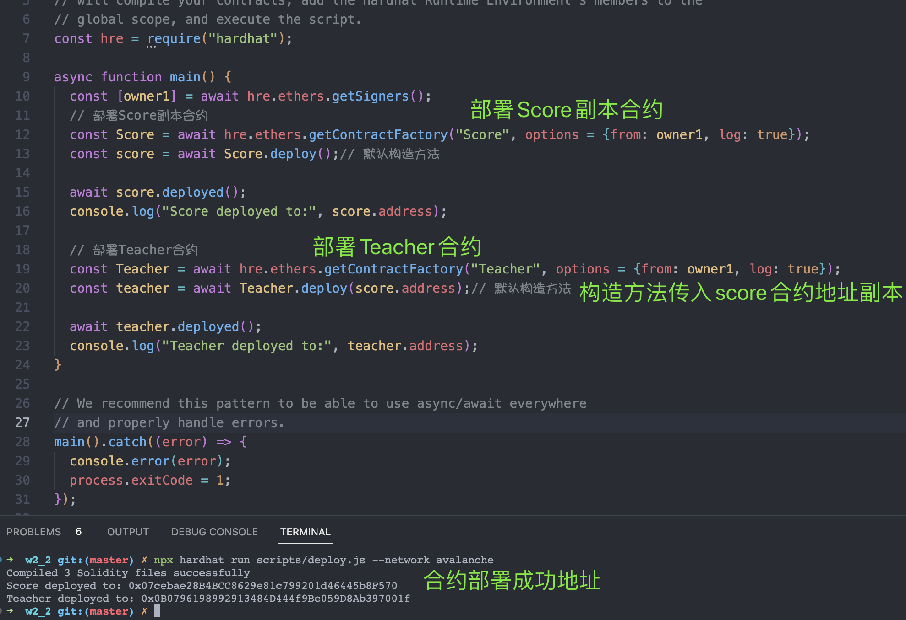
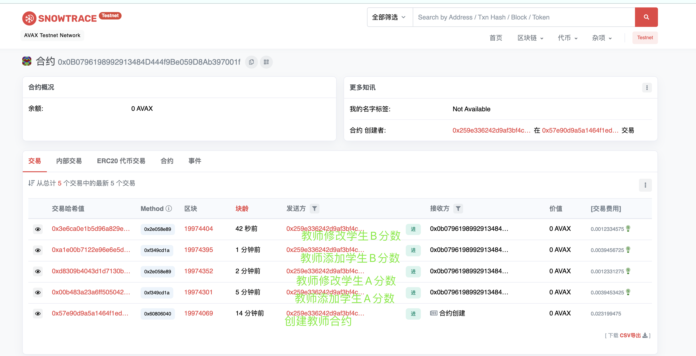

## W2-1作业
### 1. 编写合约Score, 用于记录学生(地址)分数：
* 要求：(1) 仅有老师， 可以添加和修改学生分数   （2）分数不可以大于100
  定义IScore接口
```
// SPDX-License-Identifier: UNLICENSED
pragma solidity ^0.8.9;

interface IScore {
    function addScore(address studentAddr, uint8 score) external;

    function updateScore(uint8 score) external;

    function showScore() external view returns(uint8);
}
```
  编写Score合约代码
```
// SPDX-License-Identifier: UNLICENSED
pragma solidity ^0.8.9;

import "./IScore.sol";

contract Score is IScore {
    uint8 public score; // 分数
    address public studentAddr; // 学生地址
    address public teacherScAddr; // 教师合约地址, 注：此处是教师合约，非教师

    event AddScore(address indexed studentAddr, uint8 score);
    event UpdateScore(
        address indexed studentAddr,
        uint8 oldScore,
        uint8 newScore
    );

    function addScore(address _studentAddr, uint8 _score) external override {
        require(_studentAddr != address(0), "invalid student address");
        require(_score <= 100, "score incorrect");
        studentAddr = _studentAddr;
        score = _score;

        // 默认为老师添加学生，则此处设置为老师地址
        teacherScAddr = msg.sender;
        emit AddScore(studentAddr, score);
    }

    function updateScore(uint8 _score) external override onlyTeacher {
        require(_score <= 100, "score incorrect");
        uint8 oldScore = score;
        score = _score;
        emit UpdateScore(studentAddr, oldScore, score);
    }

    function showScore() external view override returns(uint8){
        return score;
    }

    modifier onlyTeacher() {
        require(
            msg.sender == teacherScAddr,
            "only teacher smartcontract is allowed modify score"
        );
        _;
    }
}

```
### 2. 编写合约Score, 用于记录学生(地址)分数：
```
// SPDX-License-Identifier: UNLICENSED
pragma solidity ^0.8.9;

import "./IScore.sol";

contract Teacher {
    address public teacherAddr; // 教师地址
    mapping(address => address) public students; // 学生地址=>分数
    address public proxyScoreAddr; // score合约副本，用于创建score合约

    event UpdateStudentScore(
        address indexed score_addr,
        address indexed student_addr,
        uint8 score,
        bool is_created
    );

    constructor(address _proxyScoreAddr) {
        require(address(IScore(_proxyScoreAddr) ) != address(0), "require proxy score");
        teacherAddr = msg.sender;
        proxyScoreAddr = _proxyScoreAddr;
    }

    function addStudentScore(
        address studentAddr,
        uint8 score
    ) external onlyTeacher checkScoreAndStudentAddr(studentAddr, score) returns (address scoreAddr){
        require(students[studentAddr] == address(0), "student score is duplicate");

        // 代理方式生成部署score合约
        scoreAddr = deployMinimal(proxyScoreAddr);
        // 添加学生分数
        IScore(scoreAddr).addScore(studentAddr, score);
        // 添加学生成绩映射
        students[studentAddr] = scoreAddr;

        emit UpdateStudentScore(scoreAddr, studentAddr, score, true);
    }

    function updateStudentScore(
        address studentAddr,
        uint8 score
    ) external onlyTeacher checkScoreAndStudentAddr(studentAddr, score) {
        address score_addr = students[studentAddr];
        require(score_addr != address(0), "student score isn't exists");
        // 更新学生成绩
        IScore(score_addr).updateScore(score);

        emit UpdateStudentScore(score_addr, studentAddr, score, false);
    }

    function getStudentScore(address studentAddr) external view returns(uint8 score){
        require(studentAddr != address(0), "invalid student address");

        address score_addr = students[studentAddr];
        require(score_addr != address(0), "student score isn't exists");

        score = IScore(score_addr).showScore();
    }

    // 通过代理生成Score合约
    // https://github.com/OpenZeppelin/openzeppelin-sdk/blob/master/packages/lib/contracts/upgradeability/ProxyFactory.sol
    function deployMinimal(address _logic) internal returns (address proxy) {
        bytes20 targetBytes = bytes20(_logic);
        // solhint-disable-next-line no-inline-assembly
        assembly {
            let clone := mload(0x40)
            mstore(
                clone,
                0x3d602d80600a3d3981f3363d3d373d3d3d363d73000000000000000000000000
            )
            mstore(add(clone, 0x14), targetBytes)
            mstore(
                add(clone, 0x28),
                0x5af43d82803e903d91602b57fd5bf30000000000000000000000000000000000
            )
            proxy := create(0, clone, 0x37)
        }
        return proxy;
    }

    modifier checkScoreAndStudentAddr(address studentAddr, uint8 score) {
        require(studentAddr != address(0), "invalid student address");
        require(score <= 100, "score incorrect");
        _;
    }

    modifier onlyTeacher() {
        require(msg.sender == teacherAddr, "only teacher is allowed");
        _;
    }
}
```

### 3. 使用 Hardhat 部署Teacher合约和Score合约副本
* 脚本命令
```
npx hardhat run scripts/deploy.js --network avalanche
```
---
* Teacher链上地址
```
https://testnet.snowtrace.io/address/0x0B0796198992913484D444f9Be059D8Ab397001f
```
* Score链上地址
```
https://testnet.snowtrace.io/address/0x07cebae28B4BCC8629e81c799201d46445b8F570
```
* 截图
<p align="center">
  
</p>

### 4. explorer执行相关方法
* 截图
<p align="center">
  
</p>

* 教师添加学生分数明细
```
https://testnet.snowtrace.io/tx/0x00b483a23a6ff5050429b21760fefb463a5143363364837bf8b00975c2e6ad31
```
* 教师修改学生分数明细
```
https://testnet.snowtrace.io/tx/0xd8309b4043d1d7130b940ab87b549f464d2c47b34460e5d64a2e8c68ee7e7af3
```