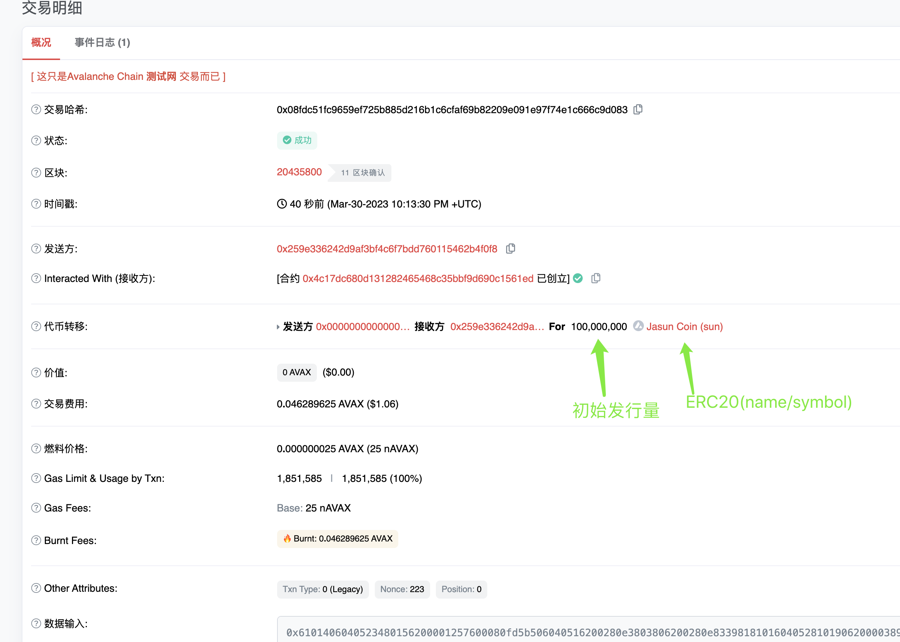

## W3-1作业
### 1. 发行一个 ERC20Token(用自己的名字)， 发行 100000 token：
* 引入Openzepplin，继承ERC20/ERC20Permit并且设置名称为`Jasun Coin`, 符号为`sun`<br>
代码如下： 
```
// SPDX-License-Identifier: UNLICENSED
pragma solidity ^0.8.9;

import "@openzeppelin/contracts/token/ERC20/ERC20.sol";
import "@openzeppelin/contracts/token/ERC20/extensions/draft-ERC20Permit.sol";

contract JasunToken is ERC20, ERC20Permit {
    constructor(uint256 initialSupply) ERC20("Jasun Coin", "sun") ERC20Permit("Jasun Coin") {
        _mint(msg.sender, initialSupply);
    }
}

```
### 2. 编写一个金库 Vault 合约:<br>
① 编写 deposit 方法，实现 ERC20 存入 Vault，并记录每个用户存款金额(approve/transferFrom)<br>
② 编写 withdraw 方法，提取用户自己的存款<br>
代码如下： 
```
// SPDX-License-Identifier: UNLICENSED
pragma solidity ^0.8.9;

import "@openzeppelin/contracts/token/ERC20/IERC20.sol";
import "@openzeppelin/contracts/utils/math/SafeMath.sol";

contract Vault{
    using SafeMath for uint256;

    mapping(address => uint256) public balances;
    address public admin;
    IERC20 public token;

    event DepositMade(address indexed from, address indexed to, uint256 amount);
    event WithdrawalMade(address indexed from, address indexed to, uint256 amount);

    constructor(address _admin,address _tokenAddr) {
        admin = _admin;
        token = IERC20(_tokenAddr);
    }

    function deposit(uint256 _amount) public {
        require(token.balanceOf(msg.sender) >= _amount, "Insufficient balance");
        // 采用安全转账，判断返回值
        bool success = token.transferFrom(msg.sender, address(this), _amount);
        require(success, "Failed to transfer ERC20");

        balances[msg.sender] = balances[msg.sender].add(_amount);
        
        emit DepositMade(msg.sender, address(this), _amount);
    }

    function withdraw(uint256 _amount) public {
        require(balances[msg.sender] >= _amount, "Insufficient balance");
        // 采用安全转账，判断返回值
        bool success = token.transfer(msg.sender, _amount);
        require(success, "Failed to transfer ERC20");

        balances[msg.sender] = balances[msg.sender].sub(_amount);

        emit WithdrawalMade(address(this), msg.sender, _amount);
    }
}
```

### 3. 进阶练习:
* 要求：使用 ERC2612 标准Token ， 使用签名的方式 deposit
```
// SPDX-License-Identifier: UNLICENSED
pragma solidity ^0.8.9;

import "@openzeppelin/contracts/token/ERC20/IERC20.sol";
// 引入IERC20Permit接口
import "@openzeppelin/contracts/token/ERC20/extensions/draft-IERC20Permit.sol";
import "@openzeppelin/contracts/utils/math/SafeMath.sol";

contract Vault{
    // ...与2上述合约雷同

    // 此处增加ERC2612离线授权合约方式
    function depositWithPermit(uint256 _amount, uint256 deadline, uint8 v, bytes32 r, bytes32 s) public {
        IERC20Permit(address(token)).permit(msg.sender, address(this), _amount, deadline, v, r, s);
        deposit(_amount);
    }

    // ...与2上述合约雷同
}
```

### 4. 合约验证:
* 部署脚本
```
const { BigNumber } = require("ethers");
const hre = require("hardhat");

const {BN} = require('bn.js')
const TokenDecimals = new BN(String(1e18))

async function main() {
  const [owner1] = await hre.ethers.getSigners();
  // 部署JasunToken合约
  const Token = await hre.ethers.getContractFactory("JasunToken", options = {from: owner1, log: true});
  
  const initialAmount = String(new BN('100000000').mul(TokenDecimals)) //首次发行量
  const token = await Token.deploy(initialAmount);// 默认构造方法

  await token.deployed();
  console.log("JasunToken deployed to:", token.address);

  // 部署Vault合约
  const Vault = await hre.ethers.getContractFactory("Vault", options = {from: owner1, log: true});
  const vault = await Vault.deploy(owner1.address, token.address);

  await vault.deployed();
  console.log("Vault deployed to:", vault.address);
}

// We recommend this pattern to be able to use async/await everywhere
// and properly handle errors.
main().catch((error) => {
  console.error(error);
  process.exitCode = 1;
});

```

* 脚本命令
```
npx hardhat run scripts/deploy.js --network avalanche
```
---
* JasunToken链上地址
```
https://testnet.snowtrace.io/address/0x4c17DC680D131282465468C35BBF9D690C1561eD
```
* Vault链上地址
```
https://testnet.snowtrace.io/address/0x9bB36Ac27c2922233E25292465f8E6eECf367d6b
```
* 截图
<p align="center">
  
</p>