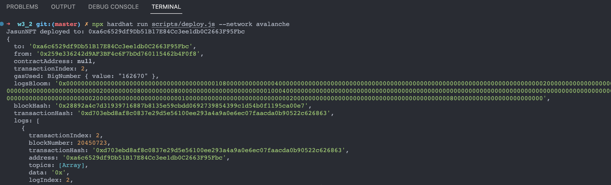

## W3-2作业
### 1. 发行一个 ERC721Token(用自己的名字)
* 要求：铸造 一个 NFT，在测试网上发行，在 Opensea 上查看<br>
① 编写JasunNFT.sol合约
```
// SPDX-License-Identifier: UNLICENSED
pragma solidity ^0.8.9;

import "@openzeppelin/contracts/token/ERC721/ERC721.sol";
import "@openzeppelin/contracts/token/ERC721/extensions/ERC721URIStorage.sol";
import "@openzeppelin/contracts/utils/Counters.sol";

contract JasunNFT is ERC721, ERC721URIStorage {
    using Counters for Counters.Counter;

    Counters.Counter private _tokenIdCounter;
    address internal owner;

    event mintNFTMade(uint256 indexed tokenId);

    constructor(string memory name_, string memory symbol_) ERC721(name_, symbol_) {
        owner = msg.sender;
    }

    function safeMint(address to, string memory uri) external returns(uint256) {
        uint256 tokenId = _tokenIdCounter.current();
        _tokenIdCounter.increment();
        _safeMint(to, tokenId);
        _setTokenURI(tokenId, uri);

        emit mintNFTMade(tokenId);
        return tokenId;
    }

    function _burn(
        uint256 tokenId
    ) internal override(ERC721, ERC721URIStorage) {
        super._burn(tokenId);
    }

    function tokenURI(
        uint256 tokenId
    ) public view override(ERC721, ERC721URIStorage) returns (string memory) {
        return super.tokenURI(tokenId);
    }
}

```
② 上传图片<br>
<p align="center">
  
</p>
③ 编写JasunNFT.json（metadata）上传到pinata服务<br>

```
{
    "title": "Jasun NFT Token",
    "description": "我的ERC721 Token",
    "image": "ipfs://QmSrMEAmWMmtuooGrGfqCkCF4v2GagNpvwaajwJtFxDr3X",
    "attributes": [
        {
            "trait_type": "Java",
            "value": "Java编程思想"
        },
        {
            "trait_type": "Rust",
            "value": "Rust权威指南"
        }
    ],
    "version": "1"
}
```
④ 部署发布<br>

```
const hre = require("hardhat");

async function main() {
  const [owner1] = await hre.ethers.getSigners();
  // 部署JasunNFT合约
  const NFT = await hre.ethers.getContractFactory("JasunNFT", options = {from: owner1, log: true});
  const nft = await NFT.deploy("JasunNFT", "JNFT");// 默认构造方法

  await nft.deployed();
  console.log("JasunNFT deployed to:", nft.address);

  const mintResult = await nft.safeMint(owner1.address, "ipfs://QmQzmCpCwXQvCg3umG1WNw8jQzFvdTRvsWFYp3PwDr8CZv")
  const result = await mintResult.wait();
  console.log(result)
}
```
<p align="center">
  
</p>
⑤ opensea查看<br>

```
https://testnets.opensea.io/collection/jasunnft-2
```
<p align="center">
  
</p>

### 2. 编写一个合约:使用自己发行的ERC20 Token 来买卖NFT:
* 要求： ① NFT 持有者可上架 NFT(list 设置价格 多少个 TOKEN 购买 NFT ) <br>
        ② 编写购买NFT 方法，转入对应的TOKEN，获取对应的 NFT <br>
